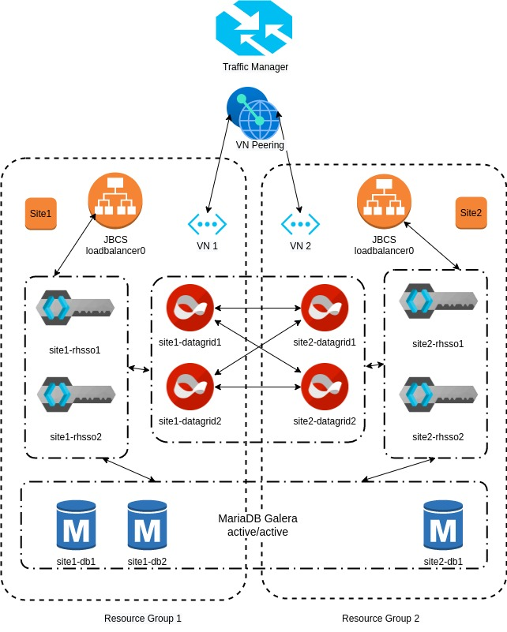

# azure-sso-demo

This repository contains reference configurations that can create resourses on Azure using CLI and deploy cross-dc-rhsso-demo on Azure with all the required configurations.

The final architecture looks like:




## Prerequisites

* rhel 8.4 with registered subscription
* ansible 2.9 / python 3.9
* `ansible-galaxy collection install -r requirements.yml`
* python3-netaddr installed on the controller host `dnf install python3-netaddr`
* Azure CLI installed on the controller host 'dnf install azure-cli'
* All the default paramerts for Azure cloud instances are provided in 'roles/azure/defaults/main.yml'
* We are using dynamic inventory provided  by Azure. Once the instances are created you can view it by "ansible-inventory -i inventory/myazure_rm.yml --graph"
* We have provided two options, we can either go with managed mariadb on Azure or we can create the RHEL instances and configuire mariadb using 'mariadb' role on cross-dc-rhsso-demo.

## Running on Azure cloud

1. Create a var-file containing your RHN credentials:
```
$ cat rhn-creds.yml
rhn_username: '<username>'
rhn_password: '<password>'
```

2. Execute the main play:
```
ansible-playbook -e @rhn-creds.yml -i cross-dc-rhsso-demo/myazure_rm.yml -i cross-dc-rhsso-demo/group_vars/all.yml -e "ansible_ssh_user=azureuser ansible_ssh_private_key_file='provide_your_ssh_private_key'" create-demo-setup.yml
```

## Security considerations

* You can provide custom certificates for the role jbcs under (cross-dc-rhsso-demo/playbooks/roles/jbcs/files). If not provided it can create a self-signed certificates for SSO/JDG TLS connectivity.

## License

Apache License v2.0 or later

See [LICENCE](LICENSE) to view the full text.


## Authors

* Harsha Cherukuri <hcheruku@redhat.com>
